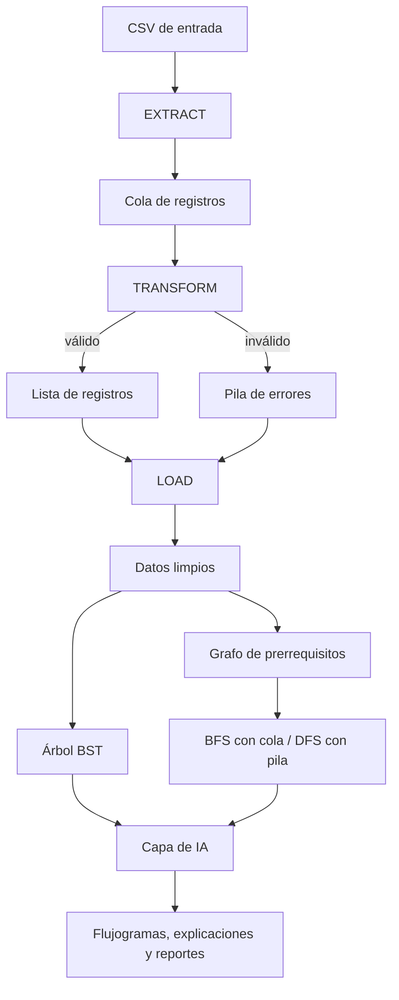

# SmartETL-DS + IA

Sistema ETL en Java con estructuras de datos propias (listas, pilas, colas, árbol BST y grafos) y una capa de Inteligencia Artificial generativa para producir flujogramas y documentación técnica.

**Universidad Técnica de Ambato** · Facultad de Ingeniería en Sistemas, Electrónica e Industrial
**Asignatura:** Estructuras de Datos · Ingeniería de Software, 3.er semestre
**Docente:** José Caiza · **Período:** 2026

## Dominio del problema

Caso académico: la institución recibe datos de estudiantes, asignaturas, matrículas y prerrequisitos desde archivos CSV que pueden contener duplicados, formatos incorrectos, campos incompletos y relaciones inconsistentes. El sistema extrae, valida, limpia y carga esos datos, y luego los indexa y relaciona para realizar consultas.

## Integrantes y responsabilidades

| Integrante | GitHub | Módulo | Hito 1 |
|---|---|---|---|
| Kerly | kerlyespinoza298-dev | Extract + Cola | `Cola`, `Extract` (lectura UTF-8) |
| Esteban | Esteban_11CAD (Esteban-EVIL) | Listas + Modelo + Transform | `Nodo`, `ListaEnlazada`, `ListaSecuencial`, clases de `model`, `Transform` |
| Gabriel | Gabriel143445 | Pila + Errores + Load + Dataset | `Pila`, `ErrorETL`, archivos CSV |
| Sebastián | sr632252-crypto | BST + Búsqueda + Ordenamiento | Arquitectura y modelo de clases en `docs/` |
| Rommel | @gamboarommel580-rgb | Grafo + BFS/DFS + Integración | Estructura del repositorio, `Main`, revisión de PR |

Todos los integrantes participan en pruebas, documentación, flujogramas de IA y defensa.

## Arquitectura



## Estructura del proyecto

```
src/
├── model/        Clases del dominio (Estudiante, Asignatura, Matricula, Prerequisito, ErrorETL)
├── estructuras/  Estructuras propias (Nodo, ListaEnlazada, ListaSecuencial, Pila, Cola, ArbolBST, Grafo)
├── etl/          Extract, Transform, Load
├── algoritmos/   Búsqueda, Ordenamiento, BFS, DFS
├── ia/           Generación de prompts, flujogramas y análisis con IA
└── Main.java     Menú principal
data/             Archivos CSV de entrada
docs/             Arquitectura, informe y evidencias de IA
tests/            Pruebas
output/           Resultados generados al ejecutar (no se sube al repositorio)
```

## Requisitos y ejecución

Requiere **JDK 17 o superior**. Ejecutar desde la raíz del proyecto:

```powershell
Get-ChildItem -Recurse src -Filter *.java | ForEach-Object { $_.FullName } > sources.txt
javac -encoding UTF-8 -d bin "@sources.txt"
java -cp bin Main
```

## Reglas de implementación

- Las estructuras fundamentales son propias; no se usan `Stack`, `Queue` ni `LinkedList` de Java en el núcleo.
- Los datos enviados a servicios de IA no contienen información personal real.
- Las claves de API se guardan en `.env`, que no se sube al repositorio.

## Flujo de trabajo en GitHub

1. Crear un Issue antes de empezar una tarea.
2. Crear una rama desde `dev`: `feature/<tarea>`.
3. Commits con convención: `feat:`, `fix:`, `docs:`, `refactor:`, `test:`, `chore:`.
4. Pull Request hacia `dev` con `Closes #N` y revisión de otro integrante.
5. `main` solo recibe versiones estables desde `dev` al cierre de cada hito.

## Avance por hitos

| Hito | Fecha | Alcance | Estado |
|---|---|---|---|
| 1 | 01 oct. | Extract + Lista + arquitectura | 🔄 En curso |
| 2 | 16 oct. | ETL: Cola, Transform, Pila | ⏳ Pendiente |
| 3 | 30 oct. | Load, búsqueda, ordenamiento | ⏳ Pendiente |
| 4A | 13 nov. | Árbol BST y recorridos | ⏳ Pendiente |
| 4B | 25 nov. | Grafo, BFS, DFS, rutas y ciclos | ⏳ Pendiente |
| 5 | 30 nov. | IA y flujogramas automáticos | ⏳ Pendiente |
| Final | 04 dic. | Integración y defensa | ⏳ Pendiente |

## Uso de Inteligencia Artificial

En esta sección se documentará qué partes del proyecto se apoyaron en IA, los prompts utilizados y los ajustes realizados, según exige la guía del proyecto.