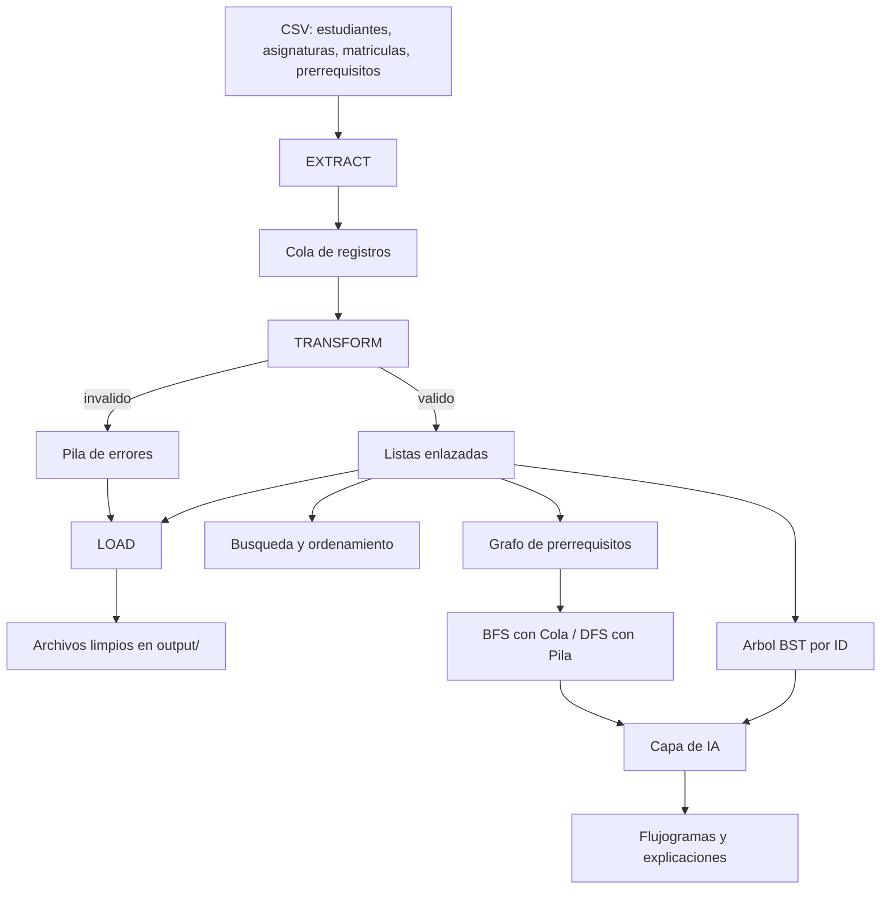
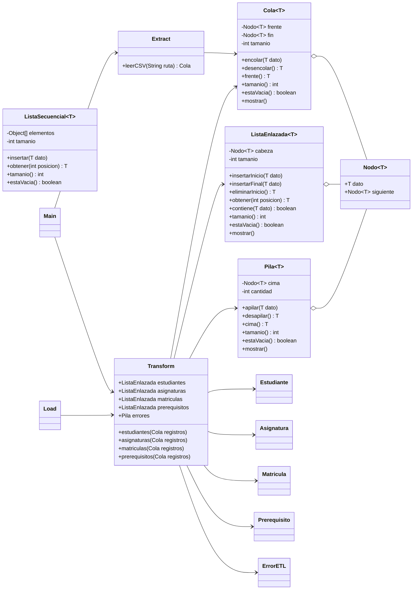

# Arquitectura del sistema SmartETL-DS + IA

> Autor: Sebastián · Hito 1

## 1. Descripción general

SmartETL-DS es un sistema en Java que procesa los datos de un caso académico: estudiantes, asignaturas, matrículas y prerrequisitos que llegan en archivos CSV. Mediante un proceso ETL (Extract, Transform, Load) el sistema lee los archivos, valida cada registro y separa los datos correctos de los que tienen errores. Para ello usa estructuras de datos implementadas por el equipo (cola, pila y listas). En los siguientes hitos los datos limpios se indexarán en un árbol BST, las asignaturas se relacionarán en un grafo de prerrequisitos y se usará IA para generar flujogramas y explicaciones.

## 2. Arquitectura completa del proyecto

Los datos recorren el sistema de arriba hacia abajo. Primero, **Extract** lee los cuatro archivos CSV y guarda cada fila en una **cola**. Después, **Transform** saca las filas de la cola una por una y las valida: los registros correctos se guardan en **listas enlazadas** y los incorrectos se guardan en una **pila de errores** junto con el motivo. Luego, **Load** escribe los datos limpios y el reporte de errores en la carpeta `output/`. A partir de las listas de registros válidos se construyen las partes de los siguientes hitos: búsqueda y ordenamiento, un árbol BST indexado por ID y un grafo de prerrequisitos recorrido con BFS (usando la cola) y DFS (usando la pila). Por último, la capa de IA usa esos resultados para generar flujogramas y explicaciones.

## 3. Paquetes del proyecto

| Paquete | Responsabilidad | Hito |
|---|---|---|
| `model` | Clases que representan los datos del dominio: `Estudiante`, `Asignatura`, `Matricula`, `Prerequisito` y `ErrorETL`, que guarda el archivo, el identificador, el motivo y el detalle de cada error. | 1 |
| `estructuras` | Estructuras de datos propias: `Nodo`, `ListaEnlazada`, `ListaSecuencial`, `Cola` y `Pila`. No se usan `Stack`, `Queue` ni `LinkedList` de Java. | 1 |
| `etl` | Las tres fases del proceso: `Extract` lee los CSV, `Transform` valida y clasifica los registros y `Load` exporta los resultados a `output/`. | 1 |
| `algoritmos` | Búsqueda, ordenamiento, BFS y DFS | 3 y 4 |
| `ia` | Generación de prompts, flujogramas y explicaciones | 5 |

## 4. Diagrama de clases (Hito 1)

El diagrama muestra cómo se relacionan las clases. Las flechas con rombo (`o--`) indican que `ListaEnlazada`, `Cola` y `Pila` están formadas por objetos `Nodo`, donde cada nodo guarda un dato y una referencia al siguiente. Las flechas simples (`-->`) indican que una clase usa a otra:

- `Main` coordina el programa y llama a `Extract` y a `Transform`.
- `Extract` lee el archivo y devuelve una `Cola` con los registros.
- `Transform` desencola esos registros, crea los objetos del modelo (`Estudiante`, `Asignatura`, etc.), guarda los válidos en una `ListaEnlazada` por cada tipo de dato y apila un `ErrorETL` en la `Pila` cuando un registro no pasa la validación.
- `Load` toma las listas y la pila que quedaron en `Transform` para generar los archivos de salida.

## 5. ¿Por qué cada estructura?

| Estructura | Uso en el proyecto | Justificación |
|---|---|---|
| Cola | Registros extraídos de los CSV | Es FIFO: el primer registro que se lee es el primero que se valida, así se respeta el orden de las filas del archivo. Encolar y desencolar cuestan O(1) porque la cola guarda referencias al frente y al fin. |
| Lista enlazada | Registros válidos | No sabemos de antemano cuántos registros serán válidos. La lista enlazada crece de forma dinámica, nodo por nodo, sin reservar espacio fijo, y además permite recorrer los datos para mostrarlos, buscarlos y exportarlos. |
| Pila | Errores de validación | Es LIFO: el último error detectado queda en la cima y es el primero que se revisa. Así se puede inspeccionar lo más reciente sin recorrer todo. Load los vacía en una pila temporal para escribirlos y luego los restaura, sin perder ninguno. |
| Lista secuencial | Búsqueda binaria y ordenamiento (Hito 3) | Está basada en un arreglo, así que permite acceso directo por índice en O(1). Eso la hace adecuada para algoritmos de ordenamiento y para búsqueda binaria, que necesitan saltar a cualquier posición; en una lista enlazada, llegar a la posición *i* cuesta O(n). |

## 6. Flujo del Hito 1

Cuando el usuario elige la opción **1. Ejecutar ETL** del menú, `Main` crea un nuevo objeto `Transform` y procesa los cuatro archivos en este orden:

1. **Extract** abre cada CSV en UTF-8, omite la línea de encabezados y las líneas vacías, divide cada fila por comas y la **encola**.
2. **Transform** **desencola** cada registro y lo valida. En estudiantes revisa que el ID tenga 10 dígitos y no esté repetido, que la edad esté entre 16 y 80, el semestre entre 1 y 12 y el promedio entre 0 y 10, y que no haya campos vacíos. En asignaturas detecta códigos duplicados. En matrículas y prerrequisitos comprueba que el estudiante y las asignaturas referenciadas existan. Por eso se procesan primero estudiantes y asignaturas.
3. Si el registro es correcto, se inserta al final de su **lista enlazada**. Si no, se **apila** un `ErrorETL` con el motivo (por ejemplo `DUPLICADO` o `REFERENCIA_INCONSISTENTE`) y se suma uno al contador de ese motivo.
4. Al terminar, el menú muestra el **resumen**: cuántos registros válidos hay de cada tipo, el total de errores y la cantidad por cada motivo.

Después, el usuario puede ver la lista de estudiantes válidos (opción 2), la pila de errores desde la cima (opción 3), buscar un estudiante por ID con búsqueda secuencial en la lista (opción 4) o volver a ver el resumen (opción 5).
