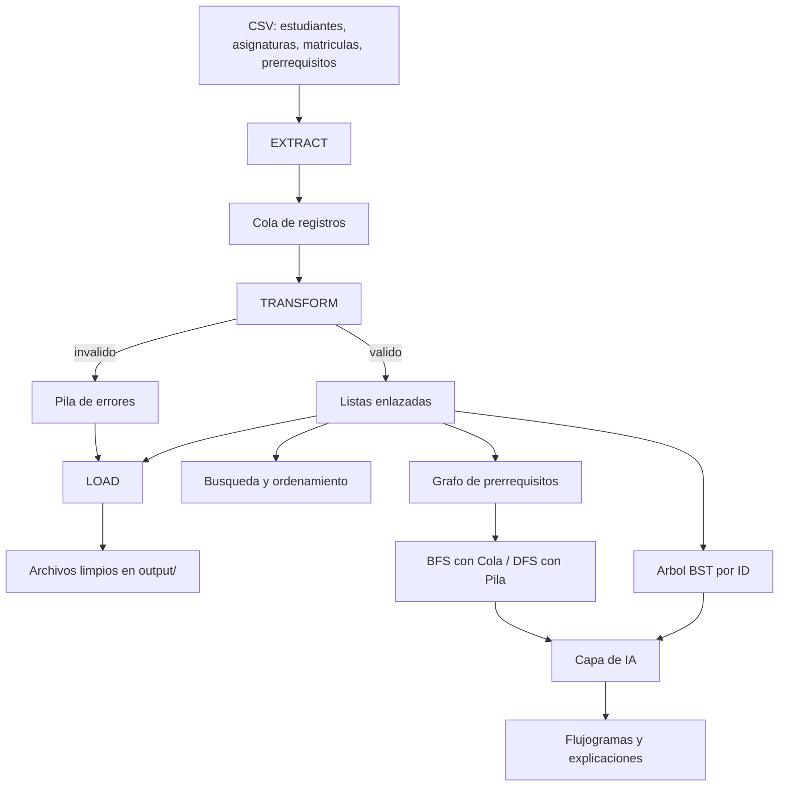

# Arquitectura del sistema SmartETL-DS + IA

> Autor: Sebastián · Hito 1

## 1. Descripción general

SmartETL-DS es un sistema en Java que procesa los datos de un caso académico: estudiantes, asignaturas, matrículas y prerrequisitos que llegan en archivos CSV. Mediante un proceso ETL (Extract, Transform, Load) el sistema lee los archivos, valida cada registro y separa los datos correctos de los que tienen errores. Para ello usa estructuras de datos implementadas por el equipo (cola, pila y listas). En los siguientes hitos los datos limpios se indexarán en un árbol BST, las asignaturas se relacionarán en un grafo de prerrequisitos y se usará IA para generar flujogramas y explicaciones.

## 2. Arquitectura completa del proyecto

Los datos recorren el sistema de arriba hacia abajo. Primero, **Extract** lee los cuatro archivos CSV y guarda cada fila en una **cola**. Después, **Transform** saca las filas de la cola una por una y las valida: los registros correctos se guardan en **listas enlazadas** y los incorrectos se guardan en una **pila de errores** junto con el motivo. Luego, **Load** escribe los datos limpios y el reporte de errores en la carpeta `output/`. A partir de las listas de registros válidos se construyen las partes de los siguientes hitos: búsqueda y ordenamiento, un árbol BST indexado por ID y un grafo de prerrequisitos recorrido con BFS (usando la cola) y DFS (usando la pila). Por último, la capa de IA usa esos resultados para generar flujogramas y explicaciones.

## 3. Paquetes del proyecto

| Paquete | Responsabilidad | Hito |
|---|---|---|
| `model` | Clases que representan los datos del dominio: `Estudiante`, `Asignatura`, `Matricula`, `Prerequisito` y `ErrorETL`, que guarda el archivo, el identificador, el motivo y el detalle de cada error. | 1 |
| `estructuras` | Estructuras de datos propias: `Nodo`, `ListaEnlazada`, `ListaSecuencial`, `Cola` y `Pila`. No se usan `Stack`, `Queue` ni `LinkedList` de Java. | 1 |
| `etl` | Las tres fases del proceso: `Extract` lee los CSV, `Transform` valida y clasifica los registros y `Load` exporta los resultados a `output/`. | 1 |
| `algoritmos` | Búsqueda, ordenamiento, BFS y DFS | 3 y 4 |
| `ia` | Generación de prompts, flujogramas y explicaciones | 5 |
